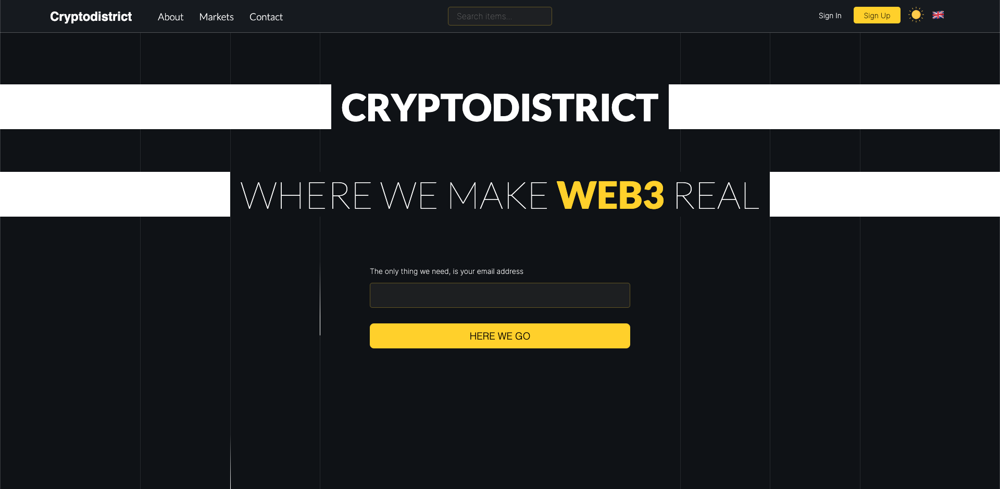
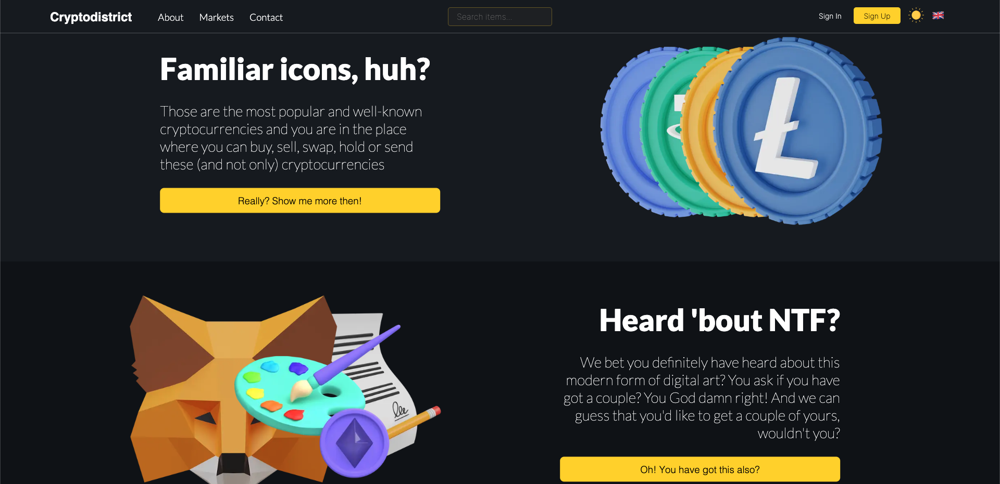
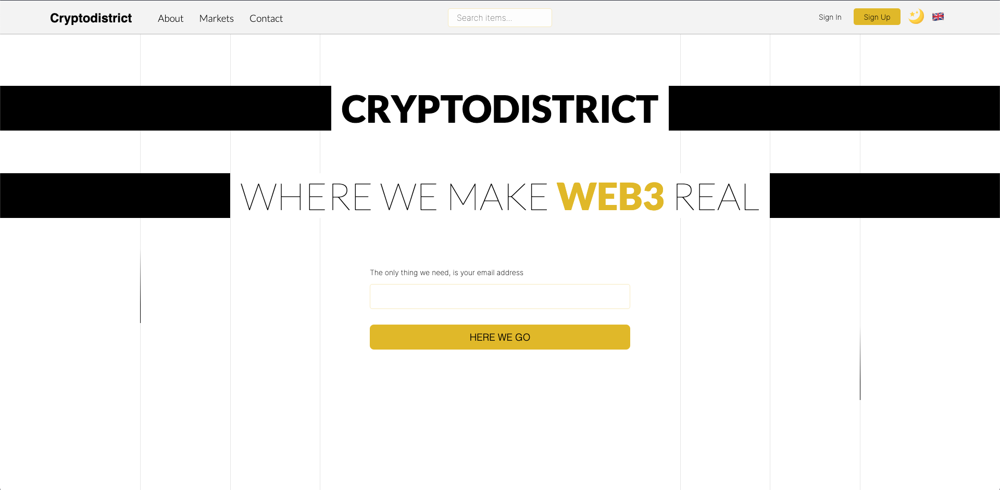
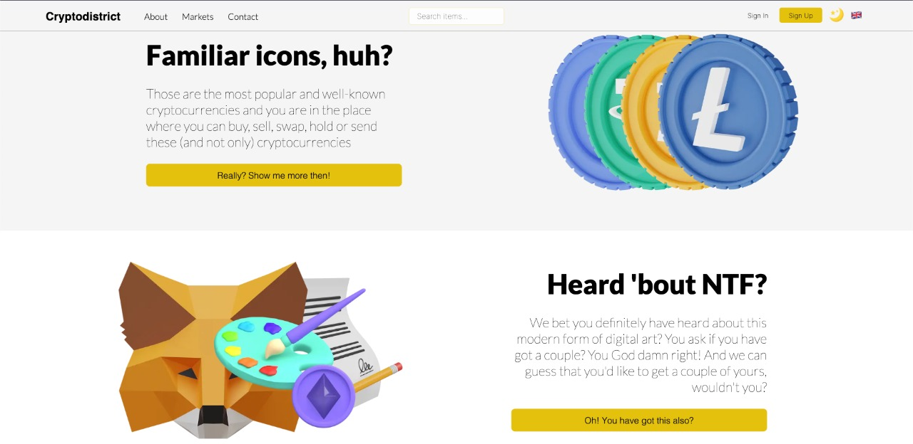
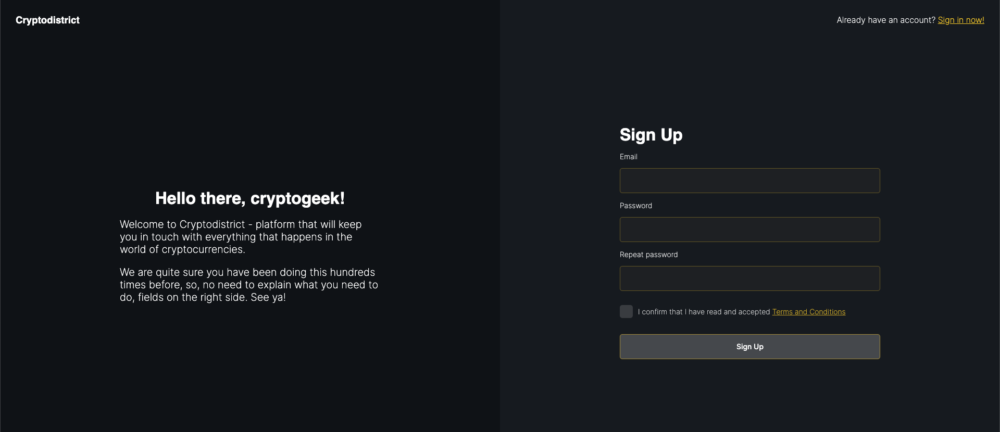
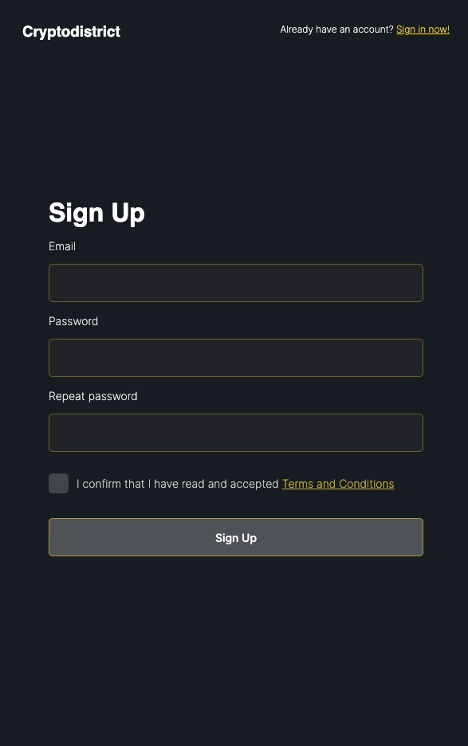

<h1 align="center">
    Cryptodistrict
</h1>

<h2 align="center">
    Where we make WEB3 real
</h2>

### Table of contents
1. [Short intro into WEB3](#short-intro-into-web3)
2. [About project implementation](#about-project-implementation)
3. [Project preview](#project-preview)
4. [Themes implementation](#themes-implementation)
5. [Language implementation](#language-implementation)
6. [Styles implementation](#styles-implementation)
7. [Layouts](#layouts)
8. [Contact](#contact)
9. [License](#license)

### Short intro into WEB3
Cryptocurrencies are digital or virtual currencies that use cryptography for security. They operate independently of a central bank or government. Bitcoin, the first and most widely used cryptocurrency, was created in 2009. Since then, thousands of other cryptocurrencies have been developed.

One of the key features of cryptocurrencies is that they are decentralized, meaning they are not controlled by any central authority or institution. Transactions are recorded on a public ledger called a blockchain, which allows for transparency and security.

Web3, also known as the decentralized web, is the next evolution of the internet. It is built on blockchain technology and allows for decentralized apps (dApps) and services to be created and run without the need for a central authority or intermediary. This means that users have more control over their data and can interact with each other directly.

One of the main advantages of Web3 is its ability to enable true peer-to-peer transactions. With traditional online transactions, a third party such as a bank or payment processor is often required to facilitate the exchange of goods or services. With Web3, transactions can take place directly between users, without the need for a middleman. This can greatly reduce transaction costs and increase security.

Another advantage of Web3 is the ability to create and use decentralized autonomous organizations (DAOs). These are organizations that are run by code and are not controlled by any one person or group. This allows for a more transparent and democratic decision-making process.

Web3 technology is still in its early stages and it is not yet clear how it will be adopted and used in the future. However, it has the potential to greatly impact industries such as finance, e-commerce, and social media. As the technology develops, it could bring about a new era of decentralized apps and services, giving users more control over their data and interactions.

Sounds interesting, isn't it? Welcome to **Cryptodistrict**!

### About project implementation

Project (its front-end side) has been implemented using `TypeScript` framework `Next.js`.

Next.js is a popular JavaScript framework for building web applications. One of its key features is its ability to use TypeScript, a strongly typed superset of JavaScript. This allows developers to catch errors early on in the development process, which can save time and improve the overall quality of the code.

One of the main advantages of using Next.js with TypeScript is improved code quality. TypeScript's static typing system allows developers to catch errors early on, before the code is even executed. This can help prevent runtime errors and make the development process more efficient. TypeScript also provides better code organization and structure, making it easier to navigate and maintain large codebases.

Another advantage of Next.js TypeScript is better scalability. TypeScript's strict typing can make it easier to maintain and update large codebases, as well as make it more manageable to add new features or make changes without introducing bugs. Next.js also has a built-in development server and support for hot code reloading which makes development process faster and more efficient.

Next.js TypeScript also offers better performance. TypeScript compiles to JavaScript, which can be executed by any browser or JavaScript runtime environment. This means that the code can be optimized for faster execution, and the end-user experience is improved.

In addition, Next.js TypeScript has a large and active community, which means that there is a wealth of knowledge and resources available to developers. This can make it easier to get help and find solutions to common problems.

In conclusion, Next.js TypeScript offers a number of advantages for web development, including improved code quality, scalability, performance, and a strong community. This combination of frameworks makes it a powerful tool for building modern web applications, and it's widely adopted by developers in many companies.

### Project preview

Below will be presented a couple of view of the project.

Details about themes and languages implementation will be described in next topics.

|  |
|:--:|
| *The main page (dark theme)* |

|  |
|:--:|
| *The main page (dark theme)* |

|  |
|:--:|
| *The main page (light theme)* |

|  |
|:--:|
| *The main page (light theme)* |

|  |
|:--:|
| *Sign up (desktop version)* |

|  |
|:--:|
| *Sign up (mobile version)* |

### Themes implementation

First of all, it's important to mention that web application has been created 2 color schemes - dark and light. Themes have been implemented using `recoil` state library.
This library allows to use and control state of the whole application, in addition, in order to save a users' choice
`localStorage` has been used to keep the value of selected theme and then, if value persists within storage,
change the theme using this variable.

### Language implementation

The whole web application has been translated on 3 languages - russian, english, polish - using `i18n` library.
Once the language is changed (using modal within header), the selected languages is applied to every part of application.

It's done by the URL prefix in front of every path. For example - `/en/forgot-password` or `/pl/forgot-password`.

### Styles implementation

In order to make work with styles much more comfortable and easy `styled-components` library has been used.
This library allows to style components by creating new tags, instead of usage of inline styles and/or `SCSS`.

This is how it looks like in project:

```typescript
import styled from 'styled-components';

export const Container = styled.div`
  padding-top: 160px;
  width: 70%;
  margin: 0 auto;
  height: calc(100vh - 60px);
`;
```

And then this `Container` is imported and used as normal `HTML` tag:

```typescript jsx
return (
  <Container>
    ...
  </Container>
);
```

### Layouts

In order to reduce the quantity of code reuse, layouts have been implemented. They allow not to import
the same components, but create one wrapper and put the code inside of it.

There are 3 layouts in this project: `Credentials`, `Default`, `NotificationMessage`.

- `Credentials` - layout is used for next pages: `sign in`, `sign up`, `forgot password`, `account confirmation`.
- `Default` - layout is normal layout with `Header` and `Footer` components.
- `NotificationMessage` - special layout used as a wrapper for other layouts in order to allow pop up notification (implemented using `NotificationMessage`).

### Contact

Developer contact - [contact@mikhailbahdashych.me](mailto:contact@mikhailbahdashych.me)

### License

Licensed by [MIT licence](LICENSE).
